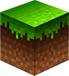

Pack Name
&middot;

=====

> Pack Description

Versioning
-----

This project uses [Semantic Versioning](//semver.org/).

Contributing
-----

Please visit our [contributing guidlines](CONTRIBUTING.md).

Code of Conduct
-----

Participants in this project follow a strict [code of conduct](CODE_OF_CONDUCT.md).

Licensing
-----

 Resource Pack Title by <a xmlns:cc="http://creativecommons.org/ns#" href="https://github.com/ScottKillen" property="cc:attributionName" rel="cc:attributionURL">Author Name</a> is licensed under a <a rel="license" href="http://creativecommons.org/licenses/by-sa/4.0/">Creative Commons Attribution-ShareAlike 4.0 International License</a>. Based on a work at <a xmlns:dct="http://purl.org/dc/terms/" href="https://github.com/ScottKillen/Minecraft-Resource-Pack-Template" rel="dct:source">https://github.com/ScottKillen/Minecraft-Resource-Pack-Template</a>.
